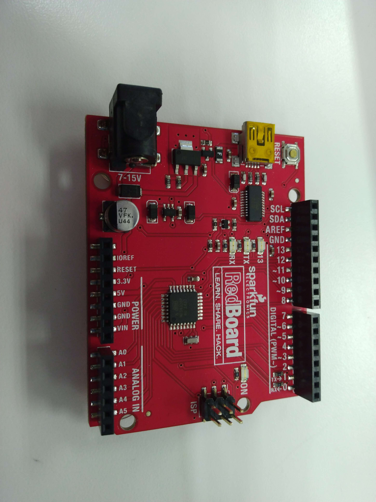
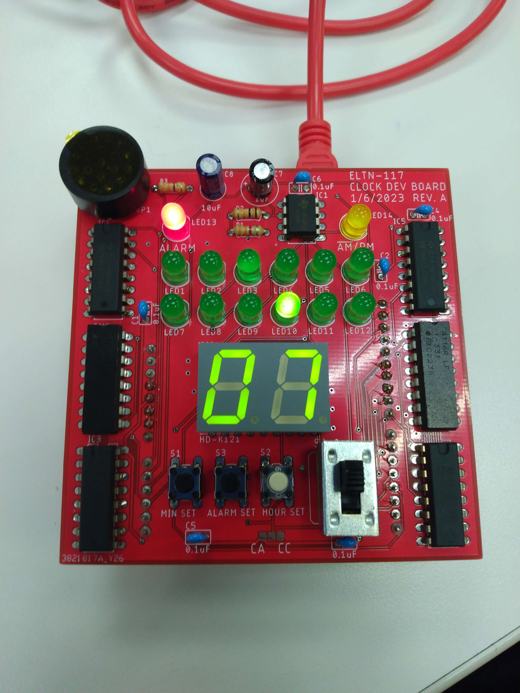

# Arduino Digital Clock
A digital clock built using arduino microcontroller, it supports the functionalities including:

* It can display minutes using 7 segment display, and displaying hours using LEDs
* It allows users to set alarms that will beep when the clock becomes the designated time
* It has a differnt track of alarm hours and minutes that's independent of the real time
* Every hour the clock will beep a randomized tone
* Users are allowed to adjust the time(hours and minutes) for both real time and alarm time manually

## Demo

* Arduino MCU

* MCU Shield with buttons and display included

* Video Demonstration
